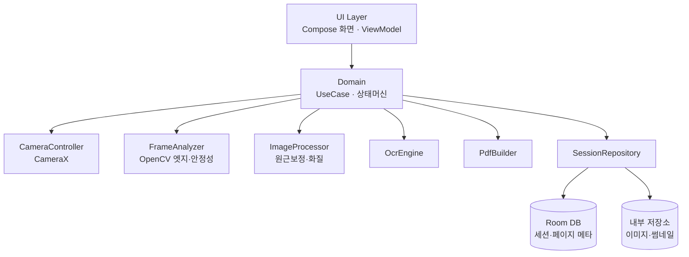
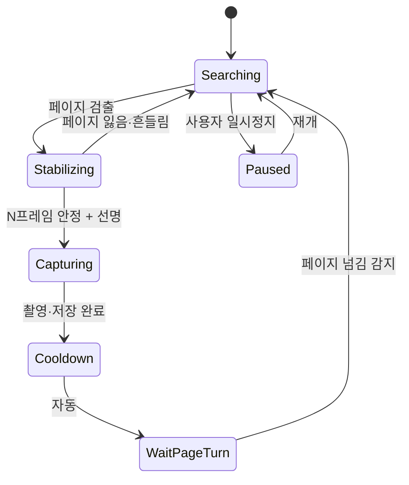
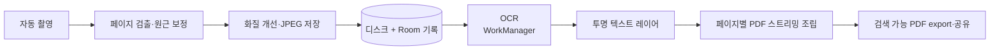

# 검색 가능한 PDF 전자책 제작 안드로이드 앱 (pdf_maker)

이 저장소는 스마트폰 카메라로 책의 각 페이지를 자동 촬영하고, 온디바이스 OCR을 통해 투명 텍스트 레이어가 포함된 검색 가능한 PDF 전자책으로 변환하는 안드로이드 앱 프로젝트입니다.

---

## 🚀 앱 구현 및 실행 안내 (Quick Start)

본 프로젝트는 아래 설계 문서의 모든 요구사항(CameraX 3중 바인딩, 실시간 자동 촬영 상태 머신, 원근 보정, ML Kit 온디바이스 OCR, 투명 텍스트 레이어 PDF 스트리밍 생성, Room DB 세션 영속화, OOM 방지 메모리 관리)을 완벽히 구현하였습니다.

### 프로젝트 구조

```text
ebook_maker/
├── app/
│   ├── build.gradle.kts          # 의존성 설정 (CameraX, Compose, Room, ML Kit, PDFBox 등)
│   ├── src/
│   │   ├── main/
│   │   │   ├── AndroidManifest.xml # 카메라 권한, FileProvider, 액티비티 설정
│   │   │   ├── java/com/ebookmaker/app/
│   │   │   │   ├── EbookApplication.kt         # 앱 진입점 및 전역 의존성 컨테이너
│   │   │   │   ├── domain/
│   │   │   │   │   ├── model/                  # ScanSession, ScanPage, Vision, State 모델
│   │   │   │   │   ├── statemachine/           # ScanningStateMachine (자동촬영 3중조건)
│   │   │   │   │   └── repository/             # SessionRepository 인터페이스
│   │   │   │   ├── data/
│   │   │   │   │   ├── camera/                 # CameraController (CameraX 라이프사이클)
│   │   │   │   │   ├── vision/                 # FrameAnalyzer (Laplacian/Diff), ImageProcessor (Warp)
│   │   │   │   │   ├── ocr/                    # OcrEngine, MlKitOcrEngine
│   │   │   │   │   ├── pdf/                    # SearchablePdfBuilder (투명 텍스트 레이어)
│   │   │   │   │   ├── local/                  # Room DB, Entity, DAO, FileManager
│   │   │   │   │   ├── worker/                 # WorkManager PdfExportWorker
│   │   │   │   │   └── repository/             # SessionRepositoryImpl
│   │   │   │   └── ui/
│   │   │   │       ├── MainActivity.kt         # 메인 액티비티 및 카메라 권한 가드
│   │   │   │       ├── navigation/             # Jetpack Compose 화면 라우팅
│   │   │   │       ├── theme/                  # 테마, 색상, 타이포그래피
│   │   │   │       └── screens/
│   │   │   │           ├── home/               # 전자책 목록, 세션 관리
│   │   │   │           ├── scan/               # 카메라 프리뷰, 검출 오버레이, HUD
│   │   │   │           ├── manage/             # 썸네일 그리드, 순서변경, 삭제, 확대보기
│   │   │   │           └── export/             # OCR 진행률, PDF 열기/공유
│   │   │   └── res/                            # 리소스 (문자열, 스타일, 파일 프로바이더 경로)
│   │   └── test/                               # 단위 테스트 (상태머신, 기하 알고리즘 검증)
├── build.gradle.kts
├── settings.gradle.kts
└── README.md
```

### 빌드 및 실행 방법

1. **Android Studio에서 열기**:
   - Android Studio (Iguana 또는 Jellyfish 이상 권장) 실행
   - `Open` 메뉴를 통해 프로젝트 디렉터리를 엽니다.
2. **Gradle 동기화 (Sync Project with Gradle Files)**:
   - 최소 SDK: API 26 (Android 8.0) 이상
   - 타겟 SDK: API 34 (Android 14)
   - Java 버전: JDK 17
3. **앱 실행**:
   - 실물 안드로이드 기기 또는 카메라가 활성화된 에뮬레이터를 연결하고 `Run (Shift + F10)`을 실행합니다.

---

## 📋 시스템 설계 문서 (Design Specification)

2026-09-20 · 작성 @Someone

### 개요
이 앱은 책의 각 페이지를 카메라로 자동 촬영하여, OCR 텍스트 레이어가 포함된 검색 가능한 PDF 전자책으로 변환하는 안드로이드 앱이다.

다섯 가지 핵심 요구사항:

1. OCR 검색 — 변환된 PDF에 투명 텍스트 레이어를 삽입해 본문 검색과 복사가 가능
2. 자동 촬영 — 사용자 개입 없이 페이지가 준비되면 자동으로 셔터가 작동
3. 페이지 자동 인식 — 실시간으로 책 영역(사각형)을 검출해 그 부분만 스캔
4. 일시정지/재개 — 촬영 세션을 중단했다가 이어서 진행
5. 메모리 관리 — 수백 페이지를 찍어도 메모리 부족(OOM) 없이 안정적으로 처리

범위: v1은 단일 사용자, 온디바이스(로컬) 처리, 한국어·영어 텍스트를 대상으로 한다. 클라우드 동기화, 다중 사용자, 표·복잡 레이아웃의 완전 재현은 후순위로 둔다.

### 요구사항 → 기술 매핑
다섯 요구사항을 각각 어떤 기술로 해결하는지 정리한다.

| 요구사항 | 핵심 기술 | 주요 라이브러리 |
| --- | --- | --- |
| 1. OCR 검색 | 온디바이스 텍스트 인식 + 투명 텍스트 레이어 | ML Kit Text Recognition v2 / Tesseract4Android + PDFBox-Android |
| 2. 자동 촬영 | 실시간 프레임 분석 후 자동 셔터 | CameraX ImageAnalysis + ImageCapture |
| 3. 페이지 자동 인식 | 엣지·윤곽 검출, 원근 보정 | OpenCV (findContours, warpPerspective) |
| 4. 일시정지/재개 | 상태 머신 + 세션 영속화 | Kotlin StateFlow, Room |
| 5. 메모리 관리 | 디스크 스트리밍 파이프라인, 비트맵 즉시 해제 | Room, WorkManager/Coroutines, 다운샘플링 |

### 기술 스택
Kotlin + Jetpack 기반 온디바이스 처리를 기본으로 한다.

- 언어/비동기: Kotlin, Coroutines + Flow
- 최소 SDK: API 26 (Android 8.0) 권장 — CameraX·ML Kit 안정 지원
- UI: Jetpack Compose (권장) 또는 View
- 카메라: CameraX (Preview, ImageAnalysis, ImageCapture)
- 영상처리: OpenCV for Android (엣지 검출, 원근 변환, 이진화)
- 저장: Room(메타데이터) + 앱 내부 저장소(이미지·썸네일)
- 백그라운드: WorkManager (OCR·PDF 조립 잡)
- 이미지 로딩: Coil 또는 Glide (썸네일 캐시)
- DI: Hilt

OCR 엔진 비교:

| 항목 | ML Kit Text Recognition v2 | Tesseract4Android |
| --- | --- | --- |
| 처리 위치 | 온디바이스 | 온디바이스 |
| 한국어 | Korean 스크립트 모델 지원 | kor.traineddata 동봉 필요 |
| 검색 PDF 생성 | 미지원 (bbox 반환 → 직접 조립) | PDF Renderer 내장 (투명 레이어 자동) |
| 속도 | 빠름 | 상대적으로 느림 |
| 라이선스 | 무료 (Google) | Apache 2.0 |

권장: v1은 Tesseract4Android로 검색 PDF를 한 번에 생성해 구현을 단순화하고, 정확도·속도가 중요해지면 ML Kit 인식 + PDFBox 조립 경로로 전환한다.

### 시스템 아키텍처
MVVM + 간단한 Clean Architecture. UI는 상태만 관찰하고, 도메인 계층이 촬영·처리 흐름을 조율하며, 데이터 계층이 카메라·OCR·PDF·저장을 담당한다.



주요 컴포넌트: CameraController(CameraX 래핑), FrameAnalyzer(실시간 엣지·안정성·선명도 판정), ImageProcessor(원근 보정·화질 개선), OcrEngine(텍스트 인식), PdfBuilder(검색 PDF 조립), SessionRepository(세션·페이지 영속화).

### 카메라 & 자동 촬영
CameraX의 세 UseCase를 동시에 바인딩한다.

- Preview: 사용자 미리보기 + 검출된 페이지 테두리 오버레이
- ImageAnalysis: STRATEGY_KEEP_ONLY_LATEST로 프레임을 드롭하며 저해상도(예: 720p) 프레임만 OpenCV로 분석 (프레임 스킵으로 약 10fps 분석)
- ImageCapture: 자동 트리거 발동 시 최대 해상도 JPEG 촬영

포커스·노출은 연속 오토포커스와 중앙 영역 측광을 사용하고, 촬영 직후 다음 페이지 준비를 위해 재분석에 들어간다. 저해상도로 판정하고 고해상도로 촬영하는 분리 구조가 성능과 화질을 동시에 확보한다.

### 페이지 자동 인식 & 이미지 보정
분석 프레임마다 책 페이지의 사각형(꼭짓점 4개)을 검출하고, 촬영된 고해상도 이미지에 원근 보정을 적용한다.

검출 파이프라인 (OpenCV):

1. 그레이스케일 → 가우시안 블러
2. Canny 엣지 검출 또는 adaptive threshold
3. findContours → 면적 큰 순 정렬
4. approxPolyDP로 사각형 근사 → 화면 면적의 일정 비율(예: 25%) 이상인 사각형만 페이지로 인정

촬영 후 보정:

- 검출된 네 점으로 getPerspectiveTransform + warpPerspective → 정면 직사각형으로 펴기
- 화질 개선: adaptive threshold 이진화 또는 대비·샤픈, 컬러 유지 옵션 제공
- 자동 회전 및 기울기 보정(deskew)

### 자동 촬영 트리거 로직
페이지 사각형이 충분히 크고, 흔들리지 않으며, 선명할 때 자동 셔터가 발동한다. 촬영 후에는 페이지 넘김을 감지할 때까지 대기해 중복 촬영을 막는다.

트리거 조건 (모두 만족):

- 페이지 검출 + 화면 면적 비율이 임계값 이상
- 안정성: 최근 N프레임(예: 8~10프레임 ≈ 0.8초) 동안 꼭짓점 이동량이 임계 픽셀 미만
- 선명도: Laplacian 분산이 임계값 이상 (블러 컷)



페이지 넘김 감지: 촬영 후 프레임 간 차분(히스토그램·프레임 diff)이 커졌다가 다시 안정되면 새 페이지로 간주해 다음 촬영을 준비한다.

### 일시정지 / 재개 & 세션 영속화
촬영 세션은 상태 머신의 Paused 상태로 언제든 멈추고 재개할 수 있으며, 앱이 종료돼도 Room에 저장된 세션으로 이어서 진행한다.

- 일시정지: ImageAnalysis 자동 트리거를 비활성화하고 지금까지의 페이지를 유지
- 재개: 마지막 페이지 인덱스부터 이어서 촬영
- 프로세스 사망 대비: 각 페이지는 촬영 즉시 디스크 저장 + Room 기록 → 재시작 시 세션을 복원하고, 처리되지 않은 페이지는 재처리 큐로 보냄
- 세션 상태: IDLE / SCANNING / PAUSED / PROCESSING / EXPORTING / DONE

### OCR & 검색 가능 PDF 생성
검색 가능 PDF는 페이지 이미지 위에 보이지 않는(투명) 텍스트 레이어를 OCR 글자 위치에 맞춰 얹은 PDF다. 화면에는 스캔 이미지가 보이지만 그 위에 정렬된 텍스트로 검색과 복사가 된다.

경로 A — Tesseract 원스톱 (v1 권장)

- Tesseract4Android의 PDF Renderer가 OCR과 투명 텍스트 레이어 PDF를 한 번에 생성
- kor + eng traineddata 동봉, 페이지별로 렌더 후 이어붙임
- 장점: 구현 단순, 위치 정렬 자동 · 단점: 상대적으로 느림

경로 B — ML Kit + PDFBox 조립

- ML Kit Text Recognition v2로 텍스트와 각 요소의 bounding box 획득
- PDFBox-Android로 이미지를 그린 뒤 해당 좌표에 렌더 모드 3(invisible)으로 텍스트 배치
- 장점: 빠르고 정확 · 단점: 좌표 스케일링·정렬을 직접 구현

공통: OCR은 페이지 단위로 WorkManager 백그라운드에서 처리하고, 실패 페이지는 재시도하며 진행률을 표시한다.

### 메모리 관리 전략
원칙: 어떤 순간에도 메모리에는 처리 중인 1~2페이지의 비트맵만 존재한다. 나머지는 전부 디스크 파일과 Room 메타데이터로만 관리한다.

1. 즉시 디스크화: 촬영 → 보정 → JPEG 저장 → 비트맵 recycle. 리스트에는 파일 경로만 보관
2. 다운샘플링: 목표 DPI(예: 200~300)에 맞춰 처리 해상도를 제한, BitmapFactory.Options.inSampleSize 활용
3. 썸네일 분리: UI 그리드는 작은 썸네일만 로드 (Coil/Glide 캐시)
4. 스트리밍 조립: PDF는 export 시 페이지를 하나씩 디스크에서 읽어 추가하고 flush → 전체를 메모리에 올리지 않음
5. 백프레셔: 촬영 속도가 처리 속도를 앞서면 bounded queue로 제어
6. 명시적 해제: try/finally로 Bitmap과 OpenCV Mat을 확실히 반환
7. largeHeap 남용 금지, LeakCanary로 누수 점검

### 데이터 모델 (Room)
두 개의 엔티티로 세션과 페이지를 관리한다. 이미지 자체는 파일로 저장하고 DB에는 경로와 상태만 둔다.

```text
ScanSession
  id: Long (PK)
  title: String
  createdAt: Long
  status: SessionStatus   // IDLE/SCANNING/PAUSED/PROCESSING/EXPORTING/DONE
  pageCount: Int
  pdfPath: String?

ScanPage
  id: Long (PK)
  sessionId: Long (FK -> ScanSession)
  index: Int             // 페이지 순서
  imagePath: String      // 보정된 이미지
  thumbnailPath: String
  ocrText: String?       // 미리보기·검색 캐시(선택)
  status: PageStatus     // CAPTURED/PROCESSED/OCR_DONE/FAILED
  createdAt: Long
```

### 처리 파이프라인
촬영부터 PDF 내보내기까지의 데이터 흐름이다.



촬영과 OCR은 분리된 단계라, 촬영을 끝낸 뒤 일괄 OCR·조립하거나 촬영과 동시에 백그라운드 OCR을 돌리는 두 방식 모두 가능하다.

### 화면 흐름 & UX
- 홈: 스캔 세션(전자책) 목록, 새 스캔 시작
- 스캔 화면: 카메라 프리뷰 + 검출 테두리 오버레이 + 상태(검색중·촬영됨) + 촬영 카운트 + 일시정지·재개·종료 버튼, 셔터음·진동 피드백
- 페이지 관리: 촬영 페이지 썸네일 그리드, 재촬영·삭제·순서 변경
- 처리·내보내기: OCR 진행률, PDF 생성 후 공유·저장
- 접근성: 자동 촬영 시 소리·햅틱으로 상태를 전달해 화면을 보지 않아도 진행 파악

### 권한 / 보안 / 개인정보
- 권한: CAMERA(필수). 이미지를 앱 전용 내부 저장소에 두면 저장소 권한이 불필요하고, 외부 공유는 공유 인텐트·Storage Access Framework로 처리
- 온디바이스 처리: OCR·PDF 모두 로컬에서 수행 → 책 내용이 외부로 전송되지 않는 프라이버시 이점
- 저장 보안: 앱 내부 저장소 사용, 필요 시 EncryptedFile로 암호화
- 저작권 안내: 저작물 스캔은 개인적 이용 범위 내에서만 가능하다는 고지를 앱 내에 두는 것을 권장

### 개발 로드맵
MVP에서 고도화 순으로 단계적으로 개발한다.

Phase 1 (MVP)
- CameraX 프리뷰 + 수동 촬영, 디스크 저장, Room 세션
- 기본 검색 PDF (Tesseract 원스톱, kor+eng)

Phase 2 (자동화)
- OpenCV 엣지 검출 + 원근 보정
- 자동 촬영 트리거(안정성·선명도) + 일시정지·재개

Phase 3 (품질·규모)
- 메모리 파이프라인 최적화, 대량 페이지 스트레스 테스트
- 페이지 넘김 감지, 화질 개선(이진화·deskew)

Phase 4 (완성도)
- 페이지 관리 UX, OCR 엔진 선택(ML Kit 경로), 공유·백업

### 리스크 & 대응

| 리스크 | 영향 | 대응 |
| --- | --- | --- |
| 대량 페이지 OOM | 앱 크래시 | 디스크 스트리밍·즉시 해제·다운샘플링 (10장 참고) |
| 자동 촬영 오작동(흐릿·중복) | 재작업 발생 | 안정성+선명도+페이지넘김 3중 조건, 사후 재촬영 UX |
| 한국어 OCR 정확도 | 검색 품질 저하 | 이진화·해상도 확보, 엔진 비교 튜닝, 필요시 ML Kit 전환 |
| 곡면·조명(책등 굴곡) | 인식률 저하 | dewarp(선택), 촬영 가이드·조명 안내 |
| 기기별 카메라 편차 | 품질 불균일 | CameraX 추상화, 해상도·포커스 fallback |
